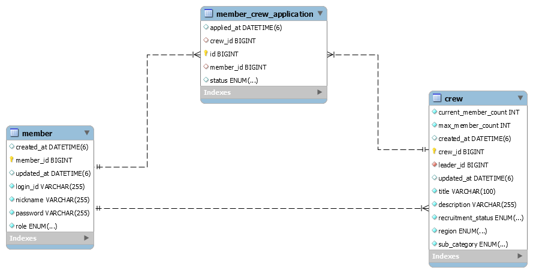
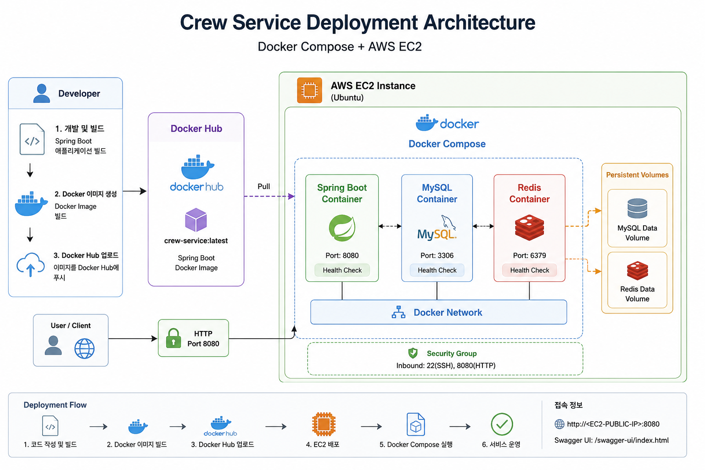
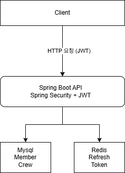
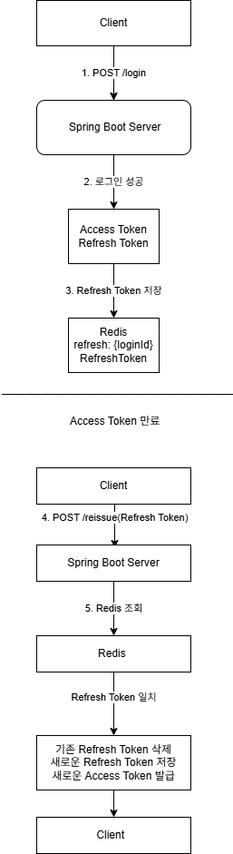
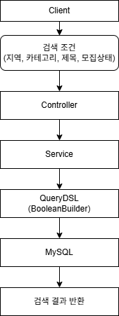
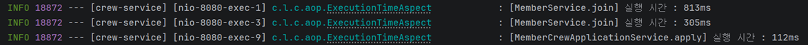
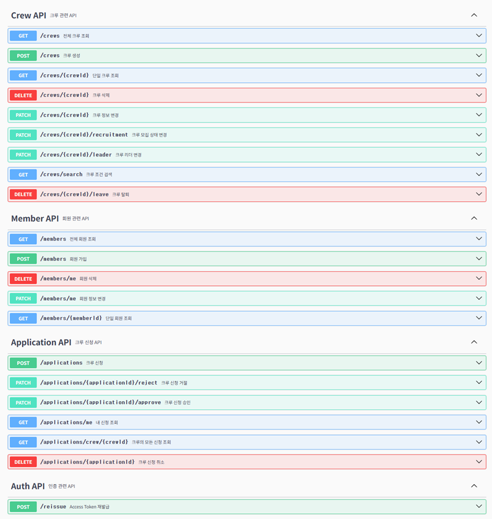

# 🚀 Crew Service

Spring Boot 기반의 크루 모집 서비스 백엔드 프로젝트입니다.

회원은 JWT 인증을 통해 로그인한 후 크루를 생성하거나 조건별 검색을 통해 원하는 크루를 찾고 신청할 수 있으며, 크루장은 신청 승인 및 거절을 통해 크루원을 관리할 수 있습니다.

Redis 기반 Refresh Token Rotation, QueryDSL 동적 검색, Pessimistic Lock을 활용한 동시성 제어, AOP 실행 시간 측정 등을 적용했습니다.
## 🎯 프로젝트 목표

- Spring Boot 기반 REST API 설계
- JWT + Redis를 활용한 인증 시스템 구현
- QueryDSL을 이용한 동적 검색 구현
- 테스트 코드 및 Swagger를 통한 유지보수성 향상
- 동시성 제어 및 인증 예외 처리 구현
---
# 🛠 기술 스택
### Language & Framework


### Security


### Database


### ORM & Query


### Build & Test


### DevOps & Deployment


### Documentation


# ✨ 프로젝트 특징

- JWT + Redis Refresh Token Rotation 적용
- QueryDSL 기반 동적 검색
- Pessimistic Lock을 이용한 동시성 제어
- Spring AOP 실행 시간 측정
- Docker Compose 기반 멀티 컨테이너(Spring Boot, MySQL, Redis) 구성
- Docker Hub를 통한 애플리케이션 이미지 배포
- AWS EC2 환경에 Docker Compose를 이용한 서비스 배포
- Swagger API 문서화
- Service / Controller 테스트 작성
- N+1 문제 해결

# 📌 주요 기능

## 회원

- 회원가입
- 로그인(JWT 발급)
- 로그아웃
- 토큰 재발급

## 크루

- 크루 생성
- 크루 조회
- 조건별 크루 검색
- 모집 상태 변경

## 신청

- 크루 신청
- 신청 승인
- 신청 거절
- 신청 취소
- 중복 신청 방지
- 권한 검증

## 인증

- Access Token 발급
- Refresh Token 발급
- Redis 저장
- Refresh Token Rotation

## 기타

- Swagger API 문서
- AOP 실행 시간 측정
- 서비스/컨트롤러 테스트
- 동시성 제어(Pessimistic Lock)

---

# 🗄 ERD


---
# 🏗 프로젝트 구조

```text
src
 ├── controller
 ├── service
 ├── repository
 ├── domain
 ├── dto
 ├── security
 │   ├── jwt
 │   ├── filter 
 │   └── ...
 ├── exception
 ├── config
 ├── aop
```

---
# 🐳 Docker 기반 배포 구조

Docker Compose를 사용하여 Spring Boot, MySQL, Redis를 각각 독립된 컨테이너로 구성했습니다.

애플리케이션은 Docker 네트워크를 통해 데이터베이스와 Redis에 연결되며 각 서비스는 컨테이너 간 통신을 사용합니다.

- Spring Boot, MySQL, Redis를 컨테이너로 분리
- Docker Compose를 이용한 통합 실행 및 관리
- Docker Hub를 통해 애플리케이션 이미지를 배포
- EC2 환경에서 컨테이너 기반으로 서비스 실행

<p align="center">
  
</p>


---

# 🔐 JWT 인증 흐름

<p align="center">
  
</p>

---

# 💾 Redis Refresh Token
Refresh Token은 Redis에 저장하여 관리하며 재발급 시 Token Rotation을 적용하여 기존 Refresh Token을 삭제하고 새로운 Refresh Token을 발급합니다.

<p align="center">
  
</p>

---
# 🔍 QueryDSL

QueryDSL을 활용하여 특정 조건에 따른 동적 검색 기능을 구현했습니다.

- 지역 (region)
- 카테고리 (SubCategory)
- 제목 (title)
- 모집 상태 (RecruitmentStatus)

<p align="center">
  
</p>

---

# ⚡ AOP
커스텀 `@ExecutionTime` 어노테이션과 Spring AOP를 활용하여 서비스 계층의 메서드 실행 시간을 측정하고 로그를 기록했습니다.

### 적용 방식
- `@ExecutionTime` 어노테이션 기반 AOP 적용
- `@Around` Advice를 사용하여 메서드 실행 전후 시간 측정
- 클래스명, 메서드명, 실행 시간을 로그로 출력

<p align="center">
  
</p>

---

# 📖 API Documentation
Swagger를 적용하여 API를 문서화했습니다.

로그인 API는 Spring Security Filter에서 처리되므로 Swagger에 표시되지 않습니다.

<p align="center">
  
</p>

---

# 🧪 Test

Spring Boot Test와 MockMvc를 활용하여 서비스 계층의 비즈니스 로직과 컨트롤러를 테스트했습니다.

총 테스트 : 39개

### Service Test
- 회원가입 및 중복 회원 검증
- 크루 생성, 수정, 모집 상태 변경
- 크루 신청, 승인, 거절
- 리더 변경 및 크루 탈퇴
- 예외 및 권한 검증

### Controller Test (MockMvc)
- 회원 API
- 크루 API
- 크루 신청 API
- JWT 인증 및 인가 검증
- HTTP 상태 코드(200, 401, 403, 404) 검증

---

# 🚨 Trouble Shooting

## 1. N+1 문제 해결
### 문제

크루 신청 목록 조회 API에서 `MemberCrewApplication`을 조회한 후 연관된 `Member`와 `Crew` 정보를 조회하는 과정에서 N+1 문제가 발생했습니다.

- 신청 목록 조회 1회
- Member 조회 N회
- Crew 조회 N회

조회 건수가 증가할수록 불필요한 SQL이 반복 실행되어 성능 저하가 발생했습니다.

---

### 1차 해결 - EntityGraph 적용

처음에는 `@EntityGraph`를 적용하여 연관 엔티티를 함께 조회하도록 변경했습니다.
```java
@EntityGraph(attributePaths = {"member", "crew"})
Page<MemberCrewApplication> findByCrewId(Long crewId, Pageable pageable);

@EntityGraph(attributePaths = {"member", "crew"})
Page<MemberCrewApplication> findByMemberId(Long memberId, Pageable pageable);
```

### 한계

`@EntityGraph`를 적용하여 N+1 문제는 해결했지만 SQL 로그를 확인한 결과 동일한 `Crew` 테이블에 대한 JOIN이 중복 생성되는 것을 확인했습니다.

조회 과정에서 JOIN을 직접 제어하기 어려워 SQL을 최적화하는 데 한계가 있었습니다.

### 2차 개선 - QueryDSL Fetch Join 적용

Fetch Join을 적용하여 필요한 연관 엔티티를 한 번의 조회로 가져오도록 변경했습니다.

조회 로직을 QueryDSL로 변경하고 `fetchJoin()`을 적용하여 필요한 연관 엔티티를 한 번의 SQL로 조회하도록 개선했습니다.

```java
queryFactory
    .selectFrom(memberCrewApplication)
    .join(memberCrewApplication.member, member).fetchJoin()
    .join(memberCrewApplication.crew, crew).fetchJoin();
```
---

### 결과

- N+1 문제 해결
- 중복 JOIN 제거를 통한 SQL 최적화
- QueryDSL 기반 동적 검색과 Fetch Join을 함께 활용
- JOIN 전략을 직접 제어하여 유지보수성 향상

---

## 2. 크루 승인 동시성 문제 해결

### 문제

크루 승인 API에서 동시에 여러 사용자의 승인 요청이 들어올 경우
정원 확인과 인원 증가 로직 사이에 Race Condition이 발생할 가능성이 있었습니다.

기존 로직에서는 여러 요청이 동시에 `Crew`의 현재 인원을 조회하면
동일한 현재 인원 값을 기준으로 정원 검사를 통과할 수 있었습니다.

예시:

현재 인원: 1명

최대 인원: 2명

Thread 1 → 현재 인원 조회 (1명)

Thread 2 → 현재 인원 조회 (1명)

Thread 1 → 승인 처리 (currentMemberCount = 2)

Thread 2 → 승인 처리 (currentMemberCount = 3)

결과: 최대 정원은 2명이지만 동시에 승인 요청이 처리되어 3명이 가입되는 정원 초과 문제가 발생할 수 있었습니다.

---

### 해결 - Pessimistic Lock 적용

동시에 여러 승인 요청이 들어오는 상황에서 동일한 `Crew` 데이터에 대한 접근을 제어하기 위해
비관적 락(Pessimistic Lock)을 적용했습니다.

`Crew`의 현재 인원(`currentMemberCount`)과 최대 인원(`maxMemberCount`)은
동시성 제어가 필요한 공유 데이터이기 때문에
승인 처리 시 `Crew` 조회 단계에서 Row Lock을 획득하도록 변경했습니다.

```java
@Lock(LockModeType.PESSIMISTIC_WRITE)
@Query("select c from Crew c where c.id = :id")
Optional<Crew> findByIdWithLock(@Param("id") Long id);
```

승인 처리 시 일반 조회가 아닌 락이 적용된 조회를 사용하도록 변경했습니다.

```java
Crew crew = crewRepository.findByIdWithLock(application.getCrew().getId())
        .orElseThrow(() -> new CrewNotFoundException());

crew.increaseMemberCount();
application.approve();
```

승인 로직에서는 일반 조회 대신 락이 적용된 조회를 사용하도록 변경했습니다.

이를 통해 하나의 `Crew`에 대한 승인 요청은 동시에 처리되지 않고
락을 획득한 요청이 먼저 정원 확인 및 인원 증가를 완료한 후
다음 요청이 최신 데이터를 기준으로 처리되도록 변경했습니다.

---

### 테스트

동시성 문제가 해결되었는지 검증하기 위해
`ExecutorService`와 `CountDownLatch`를 활용하여
멀티 스레드 환경에서 동시에 승인 요청을 보내는 테스트를 작성했습니다.

```java
ExecutorService executorService = Executors.newFixedThreadPool(2);

CountDownLatch latch = new CountDownLatch(2);
```

두 개의 스레드에서 동시에 승인 요청을 실행하고
모든 요청이 완료된 후 결과를 검증했습니다.

검증 내용:

- 동시에 승인 요청이 발생해도 `currentMemberCount`가 최대 정원을 초과하지 않는지 확인
- 두 개의 신청 중 하나만 승인되는지 확인
- 실패한 요청에서 `InvalidMemberCountException`이 발생하는지 확인

```java
assertThat(crew.getCurrentMemberCount()).isEqualTo(2);

assertThat(approvedCount).isEqualTo(1);

assertThat(exceptions)
        .hasSize(1)
        .first()
        .isInstanceOf(InvalidMemberCountException.class);
```

### 결과

- `Crew` Row Lock을 통해 동일한 크루에 대한 승인 요청을 순차적으로 처리
- Race Condition 방지
- 정원 초과 승인 방지
- 데이터 정합성 유지

---
## 3. JWT 인증 실패 예외 처리 개선

### 문제

기존 JWT 인증 과정에서 인증 실패가 발생했을 때
Spring Security의 기본 에러 응답이 반환되어
클라이언트가 실패 원인을 명확하게 확인하기 어려웠습니다.

발생 가능한 상황:

- Access Token 만료
- 잘못된 JWT
- Refresh Token 사용
- 인증 정보가 없는 요청

기본 응답만으로는 인증 실패 상황을 구분하고 처리하기 어려운 문제가 있었습니다.

---

### 해결 - CustomAuthenticationEntryPoint 적용

Spring Security의 `AuthenticationEntryPoint`를 구현하여
인증 실패 시 일관된 JSON 응답을 반환하도록 개선했습니다.

```java
@Component
public class CustomAuthenticationEntryPoint implements AuthenticationEntryPoint {

    public void commence(HttpServletRequest request, HttpServletResponse response, AuthenticationException authException) throws IOException, ServletException {
        response.setStatus(HttpServletResponse.SC_UNAUTHORIZED);
        response.setContentType("application/json;charset=UTF-8");

        response.getWriter().write("""
                {
                    "status":401,
                    "message":"인증이 필요합니다."
                }
                """);
    }
}
```

Security 설정에 인증 실패 핸들러를 등록하고
`JwtFilter`에서 토큰 검증 실패 시 해당 핸들러를 호출하도록 처리했습니다.

```java
http.exceptionHandling(exception -> exception
        .authenticationEntryPoint(customAuthenticationEntryPoint));
```

```java
catch (InvalidTokenException e) {
    authenticationEntryPoint.commence(request, response, e);
    return;
}
```

### 결과
- JWT 인증 실패 시 일관된 JSON 응답 제공
- Spring Security 기본 에러 응답 개선
- 클라이언트에서 인증 실패 상황을 쉽게 처리 가능

---

# 🚀 실행 방법

## 방법 1. Docker 실행

Docker Compose를 통해 Spring Boot, MySQL, Redis 실행 환경을 구성합니다.

### 요구 사항

- Docker
- Docker Compose

---

### 1. 프로젝트 클론

```bash
git clone https://github.com/lbg0146/crew-service.git
cd crew-service
```

---

### 2. Docker Compose 실행

```bash
docker compose up -d
```

실행 시 다음 컨테이너가 생성됩니다.

| Container | Image | 역할 |
| --- | --- | --- |
| crew-service-container | lbg209/crew-service:latest | Spring Boot Application |
| mysql-container | mysql:8 | Database |
| redis-container | redis:7 | Refresh Token 저장소 |

---

### 3. 실행 확인

```bash
docker ps
```

다음 컨테이너가 정상적으로 실행되면 완료입니다.

- crew-service-container
- mysql-container
- redis-container

---

### 4. Docker 실행 환경

Docker 환경에서는 `docker` profile이 활성화됩니다.

Docker Compose 내부 네트워크를 통해 컨테이너 간 통신을 진행합니다.

- MySQL Host: `mysql`
- Redis Host: `redis`

---

### 5. Swagger

서비스 실행 후 아래 주소에서 API 문서를 확인할 수 있습니다.

```
http://localhost:8080/swagger-ui/index.html
```

---

### 6. 종료

```bash
docker compose down
```

MySQL 데이터는 Docker Volume(`mysql-data`)을 통해 유지됩니다.

---

# 방법 2. 로컬 실행

Docker를 사용하지 않고 로컬 환경에서 Spring Boot Application을 실행할 수 있습니다.

## 요구 사항

- Java 17
- MySQL 8
- Redis

---

## 1. 데이터베이스 설정

MySQL에 `crew_service` 데이터베이스를 생성합니다.

```sql
CREATE DATABASE crew_service;
```

---

## 2. 환경 설정

`application.yml`에서 로컬 환경에 맞게 데이터베이스 정보를 설정합니다.

```yaml
spring:
  datasource:
    url: jdbc:mysql://localhost:3306/crew_service
    username: root
    password: 본인의 MySQL 비밀번호

  data:
    redis:
      host: localhost
      port: 6379
```

로컬 실행 환경에서는 아래 주소를 사용합니다.

- MySQL Host: `localhost`
- Redis Host: `localhost`

---

## 3. 실행

Gradle을 이용해 실행합니다.

```bash
./gradlew bootRun
```

또는 IntelliJ에서 Spring Boot Application을 실행합니다.

---

## 4. Swagger

서비스 실행 후 아래 주소에서 API 문서를 확인할 수 있습니다.

```
http://localhost:8080/swagger-ui/index.html
```